# ThreatCraft

[](https://www.python.org/)
[](https://github.com/heeyapro/ThreatCraft/)
[](https://graphviz.org/)

**ThreatCraft** is an automated attack scenario generation tool that combines rule-based reasoning with large language models to produce structurally valid and realistic attack scenarios while reducing expert dependency, inconsistency, and hallucinated outputs.

### Demo Video

[](https://youtu.be/nrIHEKDLp2E)

## Table of Contents

1. [➤ Overview](#overview)
2. [➤ Project Files Description](#project-files-description)
3. [➤ Installation](#installation)
4. [➤ Usage Example](#usage-example)


## Overview

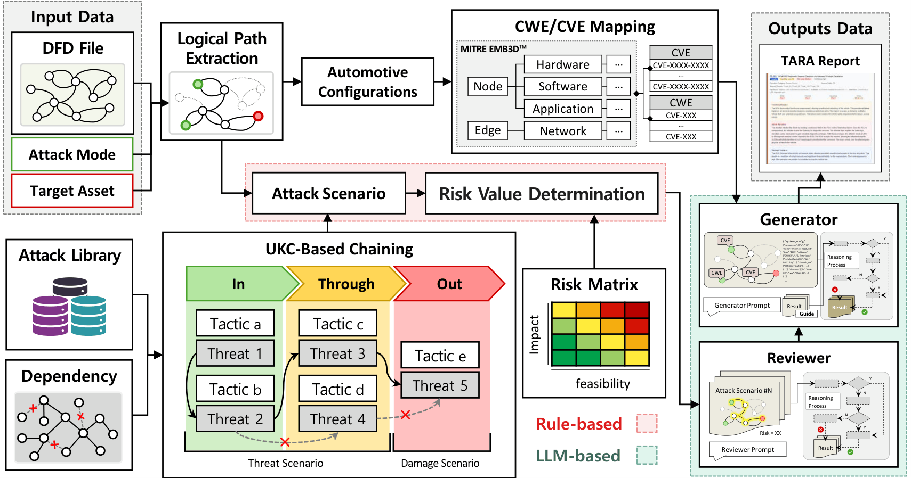

ThreatCraft is an automated attack scenario generation framework that combines a rule-based attack reasoning engine with LLM-based scenario generation. It is designed to address two key limitations of existing approaches: (i) rule-based systems rely on extensive manual rule engineering, and (ii) LLM-based approaches may generate hallucinated or structurally invalid attack scenarios.

---

### 🔁 1. Rule-Based Engine Layer

The overall architecture shown in Figure above is organized as a sequential pipeline:

- 📌 **Input Data (DFD / System Description)**
    → DataFlow Diagram(DFD), Attack Mode, Target Asset
    → (Figure: left-most input block)

- 📌 **Rule-Based Attack Engine**
    → Constructs structured attack paths using:
    - Integrated Attack Library (MITRE ATT&CK, CVE, CWE, domain KBs)
    - Asset & attack-step dependency model
    - Unified Kill Chain (UKC) phase structuring
    → (Figure: upper-middle “Rule Engine” block which is composed of 'Attack Scenario' and 'Risk Value Determination' block)

- 📌 **Risk Assessment Module**
    → Evaluates attack paths using:
    - Feasibility (attack vector: network/local/physical/etc.)
    - Impact (SFOP + asset criticality)
    → (Figure: branch under rule engine → “Risk Matrix”)

---

### 🤖 2. LLM-Guided Threat Refinement Layer

The system-level outputs are not final results. They are used as grounded constraints for LLM-based refinement.

- 📌 **Generator Agent**
    → Expands system-level paths into function-level attack scenarios
    → Injects vulnerability context (CWE / CVE / EMB3D mapping)
    → (Figure: LLM block – “Generator”)

- 📌 **Reviewer Agent**
    → Converts structured attack paths into natural-language reasoning
    → Validates logical consistency against attack knowledge base
    → (Figure: LLM block – “Reviewer”)

---

### 📊 3. Output

The final output is a structured threat report that includes:

- 🧩 Function-level attack scenarios
- 🧩 System-level validated attack graph
- 🧩 Risk scores (feasibility × impact)
- 🧩 Asset-level vulnerability mapping

→ (Figure: bottom/right output block)

---

### 🎯 Key Insight of the Architecture

ThreatCraft is not a pure LLM system nor a pure rule engine. Instead, it is a **two-stage constrained generation framework** where:

- Rule-based reasoning defines the “what is possible”
- LLM defines the “how it actually happens”
- Knowledge base grounding ensures “real-world feasibility”


## Project Files Description

```bash
ThreatCraft/
├── asset/                          # Static assets (figures, logo, references)
│   ├── logo.png                    # Project logo used in README/UI
│   ├── WorkFlow-1.png              # System architecture diagram (paper figure)
│   └── UKC_document.pdf            # Unified Kill Chain reference document
│
├── code/                           # Core implementation directory
│   │
│   ├── frontend/                   # GUI + orchestration layer
│       ├── tool_attack_paths.py           # main entry point (GUI launcher)
│       ├── automotive/                    # automotive Domain frontend
│           ├── tool_attack_paths_automotive.py         # Automotive entry point (GUI launcher)
│           ├── tool_threat_mapper_automotive.py        # Automotive Middleware between GUI and backend
│           ├── hierarchy_data_automotive.json          # Automotive CVE–CWE–EMB3D mapping dataset
│       ├── ics/                           # ics Domain frontend
│           ├── tool_attack_paths_ics.py                # ics entry point (GUI launcher)
│           ├── tool_threat_mapper_ics.py               # ics Middleware between GUI and backend
│           ├── hierarchy_data_ics.json                 # ics CVE–CWE–EMB3D mapping dataset
│       ├── enterprise/                    # enterprise Domain frontend
│           ├── tool_attack_paths_enterprise.py         # enterprise entry point (GUI launcher)
│           ├── tool_threat_mapper_enterprise.py        # enterprise Middleware between GUI and backend
│           ├── hierarchy_data_enterprise.json          # enterprise CVE–CWE–EMB3D mapping dataset
│   │
│   └── backend/                    # Threat reasoning & attack graph engine
│       ├── parse_attack_graph_automotive.py       # automotive attack scenario generator
│       ├── parse_attack_graph_ics.py              # ics attack scenario generator
│       ├── parse_attack_graph_enterprise.py       # enterprise attack scenario generator
│       │
│       └── threat_library/         # Structured threat intelligence database
│           ├── impact_feasability_map.json        # Risk scoring model (severity × feasibility)
│           ├── automotive/                        # automotive json
│               ├── asset_to_threats_automotive.json
│               │   # Maps assets → applicable threats & tactics
│               │
│               ├── attack_vector_feasibility_automotive.json
│               │   # Threat metadata (tactic, feasibility, attack vector)
│               │
│               ├── dependency_automotive.json
│               │   # Asset/threat dependency constraints for attack chaining
│               │
│               ├── impact_map_automotive.json
│               │   # SFOP impact model (Safety / Financial / Operational / Privacy)
│               │
│               └── threat_to_tactic_automotive.json
│                   # Threat → MITRE ATT&CK tactic mapping & ordering logic
│           ├── ics/                              # ics json
│               ├── asset_to_threats_ics.json
│               │   # Maps assets → applicable threats & tactics
│               │
│               ├── attack_vector_feasibility_ics.json
│               │   # Threat metadata (tactic, feasibility, attack vector)
│               │
│               ├── dependency_ics.json
│               │   # Asset/threat dependency constraints for attack chaining
│               │
│               ├── impact_map_ics.json
│               │   # SFOP impact model (Safety / Financial / Operational / Privacy)
│               │
│               └── threat_to_tactic_ics.json
│                   # Threat → MITRE ATT&CK tactic mapping & ordering logic
│           ├── enterprise/                        # enterprise json
│               ├── asset_to_threats_enterprise.json
│               │   # Maps assets → applicable threats & tactics
│               │
│               ├── attack_vector_feasibility_enterprise.json
│               │   # Threat metadata (tactic, feasibility, attack vector)
│               │
│               ├── dependency_enterprise.json
│               │   # Asset/threat dependency constraints for attack chaining
│               │
│               ├── impact_map_enterprise.json
│               │   # SFOP impact model (Safety / Financial / Operational / Privacy)
│               │
│               └── threat_to_tactic_enterprise.json
│                   # Threat → MITRE ATT&CK tactic mapping & ordering logic

└── example/
        ├── Automotive_DFD.tm7         # Example DFD
        ├── ICS_DFD_B.tm7              # Example DFD
        ├── Enterprise_DFD.tm7         # Example DFD
        ├── _ag_tmp_184849195185.html  # Output Report in FTML format
        └── _ag_tmp_184849195185.pdf   # Output Report in PDF format
│
└── smoke_test.py                      # Smoke test script
└── smoke_output/                      # Smoke test output directory
        ├── attack_graph.json          # Generated attack graph
        ├── attack_report.html         # Generated HTML report
        └── attack_report.pdf          # Generated PDF report
│
└── README_Markdown_version.md         # Markdown-only version of the README
└── REQUIREMENTS.md                    # System and software requirements
└── STATUS.md                          # Artifact badges and justification
└── [Artifact Evaluation] Abstract.pdf # Artifact Evaluation abstract
```


## Installation

Follow the steps below to set up and run **ThreatCraft** in your local environment.

1. **Install Graphviz**

   Download and install Graphviz from the official site:

   https://graphviz.org/download/

   After installation, make sure to add Graphviz to your system **PATH** (required for rendering attack graphs).
2. **Install Python dependencies**

   Run the following command in your project environment:

   ```
   pip install graphviz pillow
   ```
3. **Verify backend prerequisites**

   Ensure Python version is **3.10+** and Graphviz is accessible from the terminal:

   ```
   dot -V
   ```
4. **Run ThreatCraft**

   Navigate to the frontend directory and execute:

   ```
   cd code/frontend
   python tool_attack_paths.py
   ```

However, if **ThreatCraft** cannot be executed properly due to software dependency or local environment configuration issues, it can also be executed using **Docker**.

5. **Install WSL2 on Windows**

   If you are running ThreatCraft on Windows, install WSL2 first. Open **Windows PowerShell as Administrator** and run:

   ```
   wsl --install
   ```

   After the WSL2 installation is complete, restart the system if required.
6. **Install Docker Desktop**

   Download and install Docker Desktop for Windows from the official Docker website:

   https://docs.docker.com/desktop/setup/install/windows-install/

   After installation, launch **Docker Desktop** and keep it running.
7. **Move to the ThreatCraft artifact directory**

   Open Windows PowerShell and move to the root directory of the extracted ThreatCraft artifact.
8. **Build the Docker environment**

   Run the following command:

   ```
   docker compose build
   ```
9. **Run ThreatCraft in the Docker environment**

   Run the following command:

   ```
   docker compose up -d
   ```
10. **Access ThreatCraft through a web browser**

   After the container starts successfully, open the following URL in a web browser:

   ```
   http://localhost:6080/vnc.html?autoconnect=1&resize=scale
   ```

Once executed successfully, the system will launch the ThreatCraft and the GUI will be displayed on your screen.


## Smoke Test

A lightweight offline smoke test is provided to verify that the core rule-based analysis pipeline is working correctly before launching the full GUI workflow.

The smoke test does not require a GPT or Gemini API key. It verifies the following components:

* Python and Graphviz availability
* Required example and threat-library files
* TM7 input parsing
* Rule-based attack graph generation
* Attack-path output validation

Run the test from the root directory of the artifact:

```bash
python smoke_test.py
```

Expected output:

```text
ThreatCraft Smoke Test
========================================
[PASS] Python version: 3.10
[PASS] Graphviz: dot - graphviz version ...
[PASS] Required input files found
[PASS] Rule-based backend completed
[PASS] Output JSON created
[PASS] Attack graph nodes generated: <number>
[PASS] Attack paths generated: <number>

SMOKE TEST PASSED
```

The generated test results are saved in the following directory:

```text
smoke_output/
├── attack_graph.json
└── attack_report.html
```

After the smoke test passes, users can proceed to the full GUI workflow described below.


## Usage Example

### 🎯 Scenario Definition: Remote Attack on Vehicle Door System

We assume an attacker attempting to remotely compromise a vehicle door control system.

- **Target Asset**: `Door`
- **Trust Boundary**: `External Vehicle Boundary`
- **Attack Mode**: `Remote`

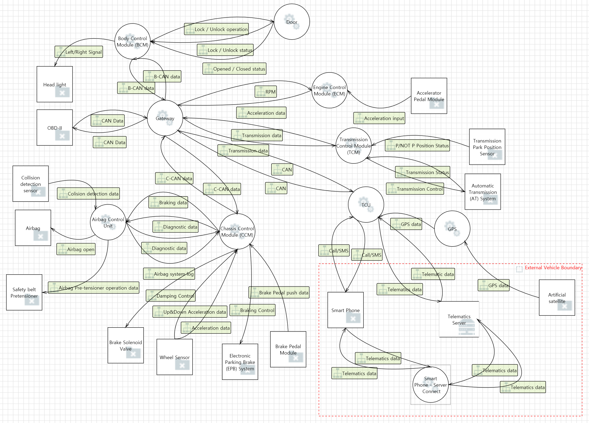

---

### 0. Select The Target Domain To Be Analysed

Select the target domain for the system under analysis. In this tutorial, the attack scenario targets a vehicle, so choose the Automotive Vehicle domain.

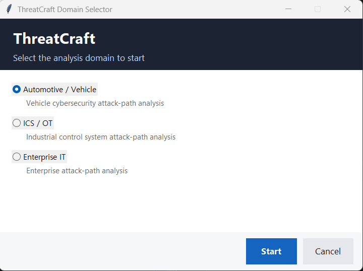

---

### 1. Launch ThreatCraft & Configure Analysis Context

After starting the application, the GUI dashboard is displayed.

Configure the analysis environment as follows:

- 📂 **DFD File Selection**
    Load the target system model (`TM7 file`) representing the vehicle architecture.

- 🧠 **LLM Configuration**
    - Select LLM backend (e.g., GPT-based model)
    - Input valid API key
    - Alternatively, select Ollama to run the LLM locally without an API key

- 🎯 **Target Definition**
    - Select **Target Asset**: `Door`

- 🌐 **Trust Boundary Selection**
    - Define system boundary: `External Vehicle Boundary`

- ⚔️ **Attack Mode**
    - Set attacker capability: `Remote`

- ▶️ Click **`Run Analysis`**

> 📌 Note: All required threat intelligence libraries (CVE/CWE/EMB3D mappings, dependency graphs, risk models) are preloaded via *Library File Settings* by default.

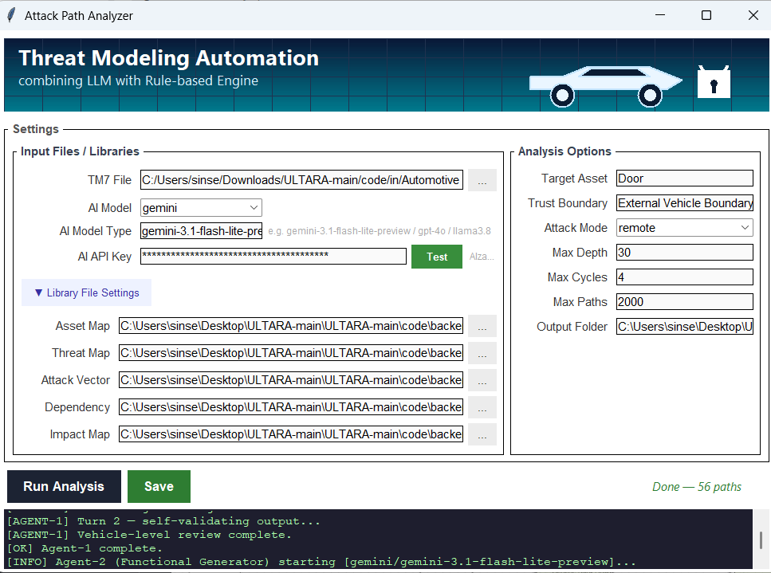

---

### 2. Configure Implementation Detail of Assets

Next, we define the implementation details for each asset.

For instance, as shown in the figure below a TCU may run a Linux operating system with multiple implementation characteristics:
- loadable kernel modules (PID-23L1) and
- Linux namespace isolation (PID-23L2).

After adding the implementation details to the assets, click “OK”.

> 📌 Note: It is not mandatory to provide implementation details for all assets.

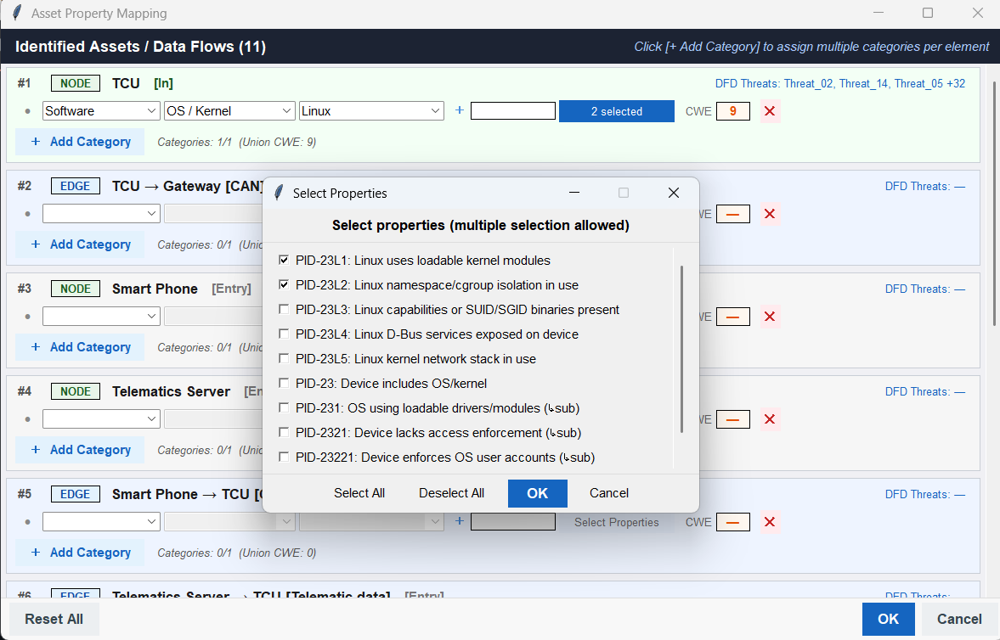

---

### 3. Check the Analysis Result

The result window consists of three tabs:

---

#### 1) Asset Mapping
Each CWE threat is mapped to a specific asset. Note that CWE entries for an asset are not provided by default; they become available only after defining the asset’s implementation details, as described in Subsection 2 (“Configure Implementation Details of Assets”).

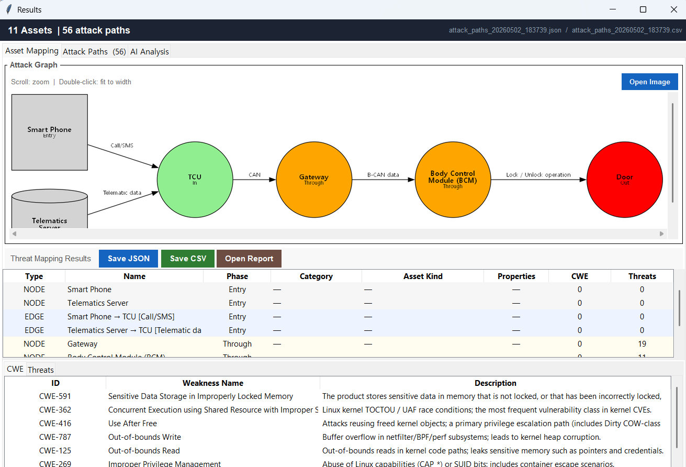

---

#### 2) Attack Paths
Each identified attack path is summarised. Each path represents a unique combination of assets and threats.

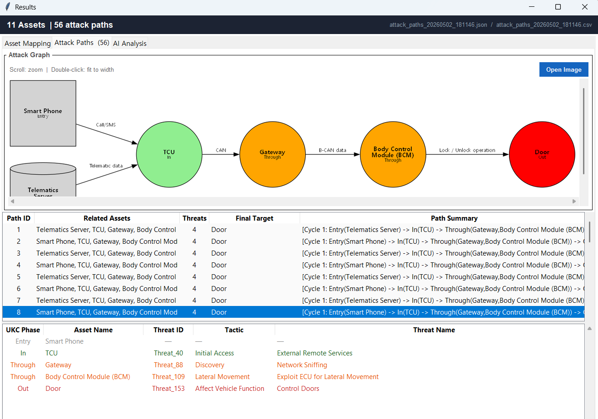

---

#### 3) AI Analysis
The AI analysis is divided into two levels:

---

##### Vehicle-Level Review
For each attack path, the tool assesses its likelihood (confidence level) and provides mitigation recommendations. Furthermore, it performs a comprehensive evaluation across all attack paths to identify and present the highest-risk path.

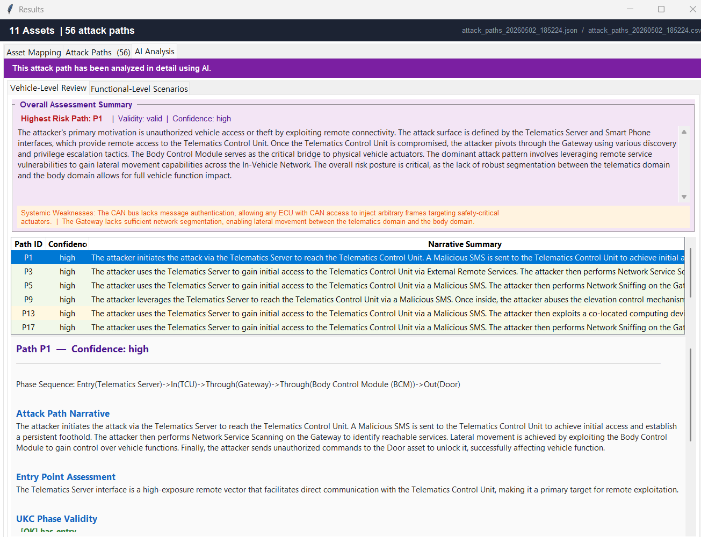

---

##### Functional-Level Review
The tool evaluates the most critical vulnerabilities within each asset in the aggregated attack tree from an SFOP (Safety, Financial, Operational, Privacy) perspective, and presents the results for each asset-specific vulnerability accordingly.

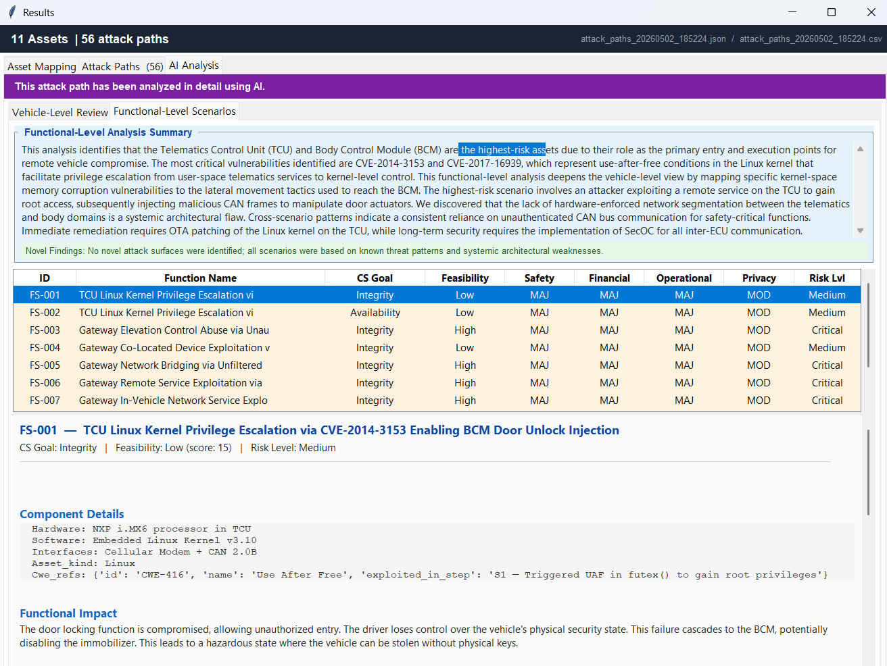

> 📌 Note: You could save its results into JSON, CSV respectively, and also, you can check this whole results displayed in TARA Report(check `example/_ag_tmp_184849195185.html`)

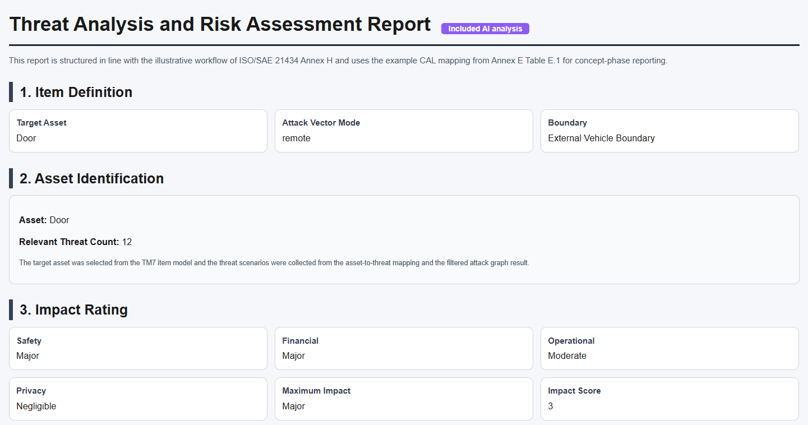

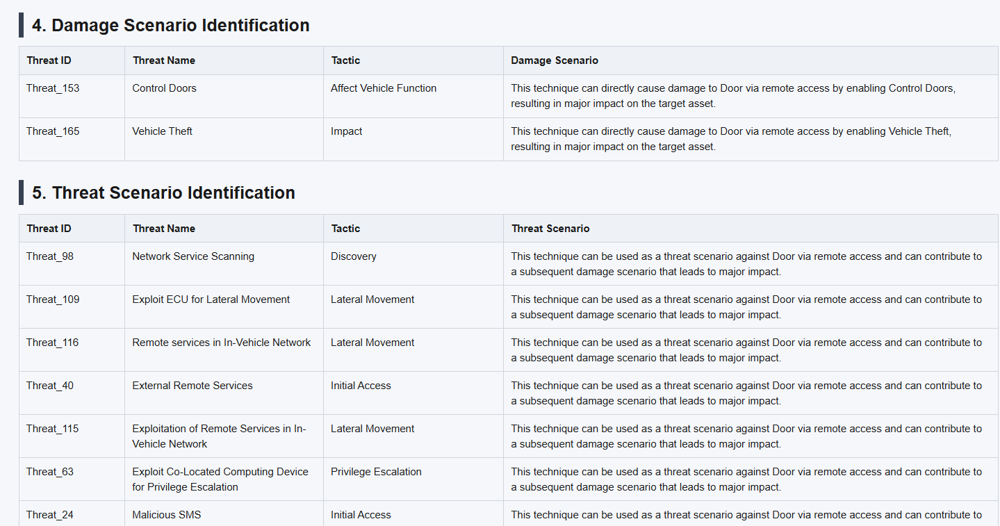

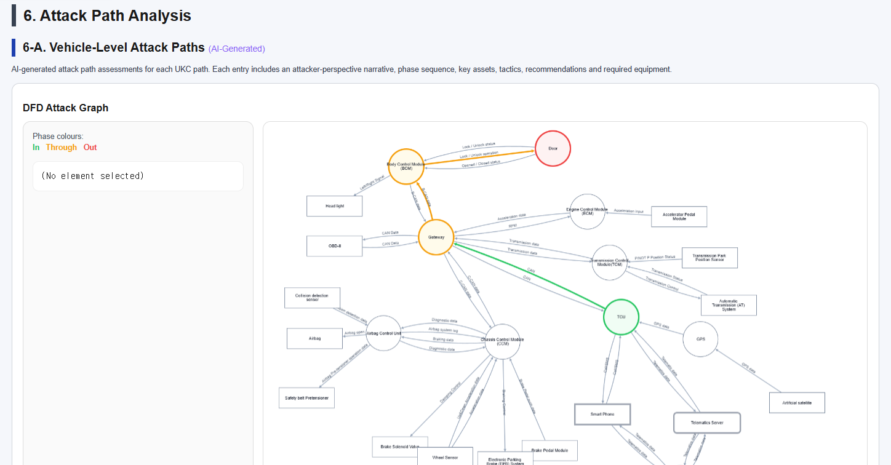

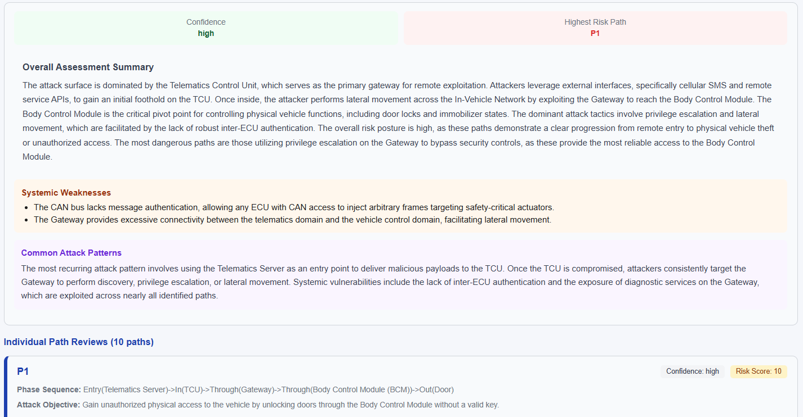

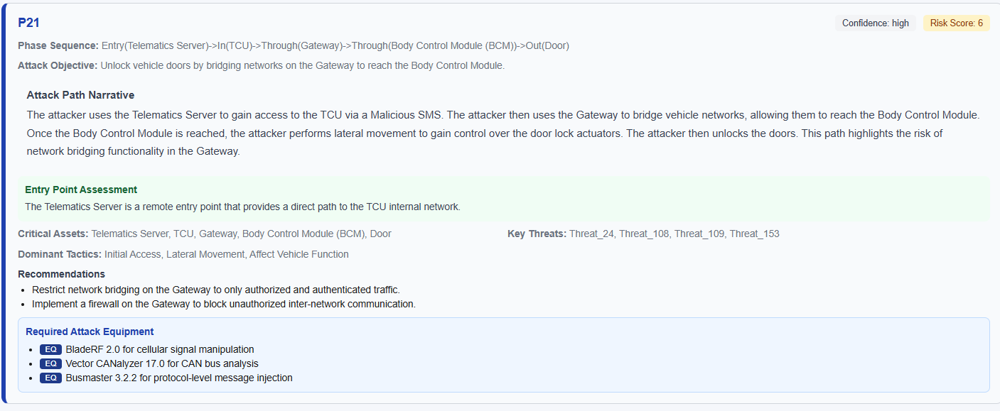

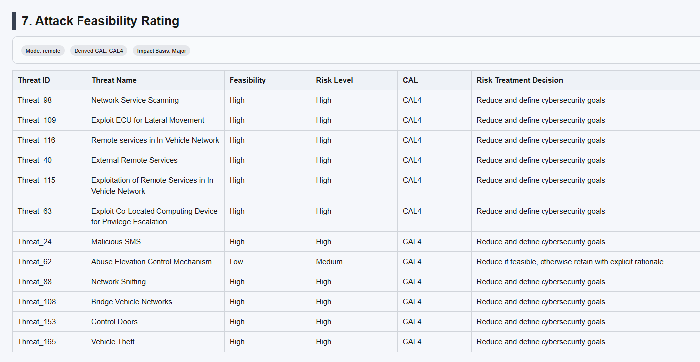

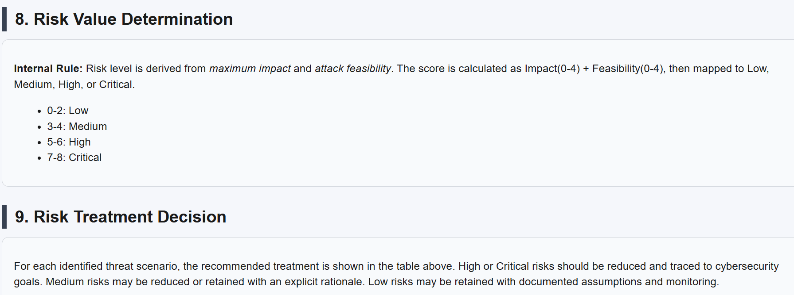


## ⚖️ License

This project is licensed under the [MIT License](LICENSE.text).

---

## ✉️ Contact

- **Seungjoo Kim (Corresponding Author)** — Professor, Korea University, School of Cybersecurity (skim71@korea.ac.kr)
- **Dohee Kang (First Author)** — M.S. course, Korea University, School of Cybersecurity (kangdohee1211@korea.ac.kr)
- **Jiwon Kwak (Second Author)** — Ph.D. course, Korea University, School of Cybersecurity (jwkwak4031@korea.ac.kr)
- **Geunwoo Baek (Third Author)** — M.S, Korea University, School of Cybersecurity (sinse100@korea.ac.kr)
- **Our Lab** — [Security Automation aNd Engineering Lab (SANE Lab)](https://sites.google.com/view/seceng/home)

---
